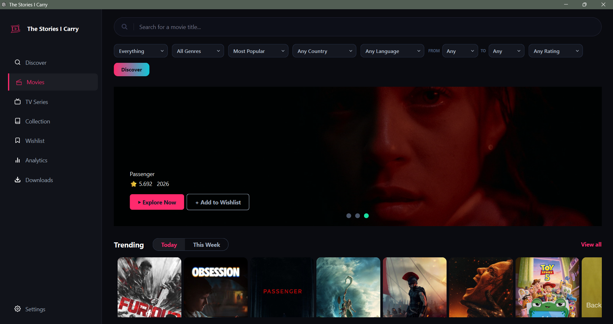
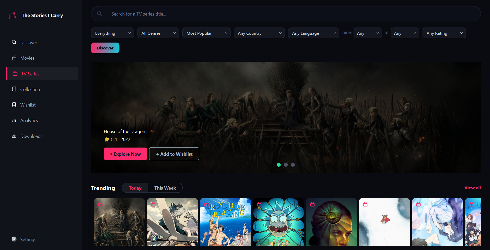
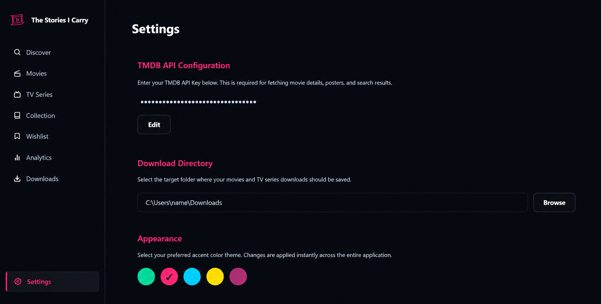

<div align="center">

# The Stories I Have Seen


<br>


</div>

---

The ultimate movie tracker for your never-ending watchlist.

Save movies, discover hidden gems, get personalized recommendations, watch, download, and keep all your future movie obsessions in one place.


---

## The Aesthetics 

<div align="center">
  <h3>The Discover Page</h3>
  <p>Immaculate vibes only. Find your next hyperfixation right here. Serving pure algorithmic slay.</p>
  
  <br><br>

  <h3>Your Cinematic Universe</h3>
  <p>Main character energy activated. Your entire movie library looking absolutely goated. Fr fr.</p>
  
  <br><br>

  <h3>Binge-Watching Era</h3>
  <p>Living rent-free in your head? Track it here. Time to lock in and touch grass never.</p>
  
  <br><br>

  <h3>The Control Room</h3>
  <p>Customize your vibe and drop that API key. We love a clean, tailored aesthetic. It’s giving ✨ organized ✨.</p>
  
</div>

---

## Running Locally

To run the application from source, make sure you have Python installed, then follow these steps:

1. Install the required dependencies:
   ```bash
   pip install -r requirements.txt
   ```

2. Run the main application file:
   ```bash
   python main.py
   ```

---

## Configuration & Data Storage

To run this application, you will need a TMDB API key. There are two ways to set this up:

### 1. The UI Way (Recommended)
Simply launch the application, navigate to the **Settings** tab on the left menu, and paste your TMDB API Key into the input box. The app will securely save it for you and instantly apply it.

### 2. The Manual Way
If you prefer setting it up before launching, you can manually create a `.env` file inside the application's global cache directory.
- **Windows**: `C:\Users\YourUsername\.cache\tsic\.env`
- **Linux**: `/home/YourUsername/.cache/tsic/.env`
- **Mac**: `/Users/YourUsername/.cache/tsic/.env`

Add the following line to the file:
```env
TMDB_API_KEY=your_api_key_here
```
*(Note: Creating a `.env` file in the project root folder will be ignored by the application to maintain global synchronization).*

### Where is my movie database?
Your personal movie collection, watch history, and app configurations are synced globally. You can find your `movies.db` database file inside the same cache directory:
`~/.cache/tsic/movies.db`

You can easily copy this file to back up your watch history or transfer it to another computer!

---

## License

This project is licensed under the MIT License. See the [LICENSE](LICENSE) file for details.